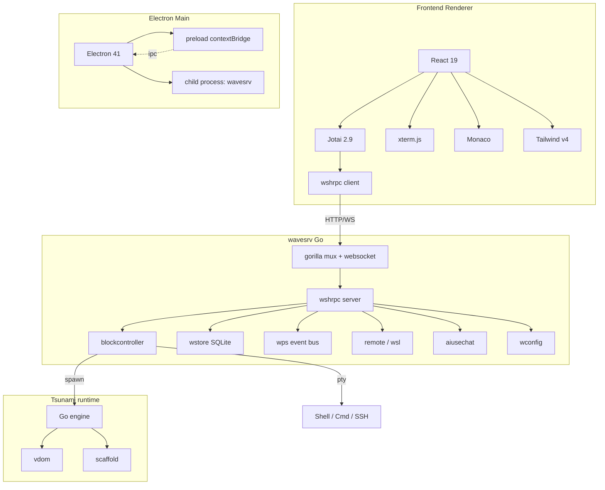
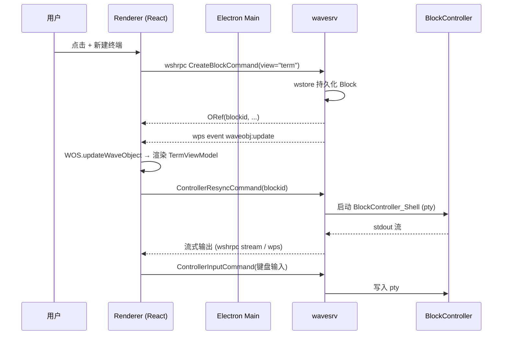
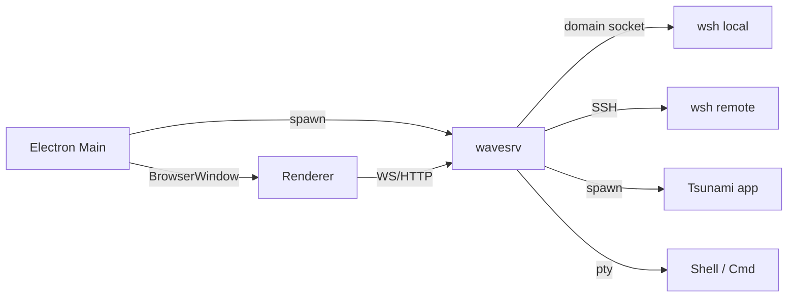

# Wave Terminal 架构文档

> 自动分析生成。覆盖技术栈、分层架构、模块组织、跨进程通信、构建流程及关键实现模式。
> 适用版本：基于 `main` 分支当前快照（2026 年 5 月）。

---

## 目录

- [1. 项目概览](#1-项目概览)
- [2. 顶层目录结构](#2-顶层目录结构)
- [3. 技术栈](#3-技术栈)
- [4. 分层架构](#4-分层架构)
  - [4.1 表现层（Frontend / React）](#41-表现层frontend--react)
  - [4.2 桌面外壳层（Electron Main）](#42-桌面外壳层electron-main)
  - [4.3 后端服务层（wavesrv / Go）](#43-后端服务层wavesrv--go)
  - [4.4 CLI 与远端层（wsh / wshremote）](#44-cli-与远端层wsh--wshremote)
  - [4.5 Tsunami 子项目](#45-tsunami-子项目)
- [5. 进程拓扑与通信](#5-进程拓扑与通信)
- [6. RPC 系统（wshrpc）](#6-rpc-系统wshrpc)
- [7. 状态管理与数据流](#7-状态管理与数据流)
- [8. 构建与代码生成](#8-构建与代码生成)
- [9. 编码约定与实现模式](#9-编码约定与实现模式)
- [10. 可视化关系图](#10-可视化关系图)
- [11. 扩展指南速查](#11-扩展指南速查)

---

## 1. 项目概览

Wave Terminal 是一款现代化跨平台终端应用，提供：

- 图形化 Block 系统（终端、文件预览、Web 视图、AI 聊天、系统信息等）
- 可拖拽的动态布局
- 多工作区 / 多 Tab
- 持久化 SSH 连接（断线自动重连）
- 内建文件浏览 / Monaco 编辑器
- `wsh` CLI 命令系统（跨终端会话共享数据）

整体形态：**Electron 壳 + 独立 Go 后端进程 + Web 渲染前端 + 跨平台 CLI**。

---

## 2. 顶层目录结构

```
waveterm/
├── frontend/              # TypeScript / React 渲染前端（Vite 构建）
│   ├── app/               # 主应用：views、blocks、stores、modals…
│   ├── builder/           # Tsunami 应用 builder（预览/调试 UI）
│   ├── layout/            # 通用 tile/dnd 布局引擎
│   ├── preview/           # 独立组件预览站（与 Electron 解耦）
│   ├── types/             # TS 类型声明（gotypes.d.ts 由 Go 生成）
│   ├── util/              # 工具函数
│   └── wave.ts            # 渲染入口
├── emain/                 # Electron 主进程（TypeScript）
├── pkg/                   # Go 后端模块（wavesrv 主代码）
├── cmd/                   # Go 可执行入口（server、wsh、generatets…）
├── tsunami/               # 内嵌的 "Tsunami" 子项目（独立 go.mod）
├── schema/                # 配置 JSON Schema 源
├── db/                    # SQLite migration / schema
├── build/                 # 构建产物 & electron-builder 资源
├── docs/                  # Docusaurus 文档站
├── tests/ / testdriver/   # 端到端 / 集成测试
├── electron.vite.config.ts
├── electron-builder.config.cjs
├── Taskfile.yml           # 统一构建/任务编排
├── go.mod / go.sum
└── package.json
```

---

## 3. 技术栈

### 3.1 前端

| 类别 | 选型 | 版本 |
|---|---|---|
| 视图 | React | ^19.2.0 |
| 状态管理 | Jotai | 2.9.3 |
| 类型系统 | TypeScript | ^5.9.3 |
| 打包 | Vite + electron-vite | ^6.4.2 / ^5.0 |
| 样式 | Tailwind v4 + 局部 SCSS | tailwindcss ^4 (`@tailwindcss/vite` ^4.2.1) |
| 终端渲染 | xterm.js (+ addons: fit/search/webgl/web-links/serialize) | ^6.0.0 |
| 代码编辑 | Monaco Editor (+ monaco-yaml) | ^0.55.1 |
| 图表 | Observable Plot、Recharts、Mermaid | — |
| 表格 | TanStack Table / Virtual | ^8 / ^3 |
| AI 客户端 | `ai` SDK + `@ai-sdk/react` | ^5.0.92 |
| Markdown | react-markdown + rehype/remark 系列 | ^9 |
| 拖拽 | react-dnd + html5 backend | ^16 |
| 不可变更新 | Immer | ^10.1.1 |
| 工具 | dayjs、debug、env-paths、semver、shell-quote | — |

### 3.2 桌面外壳

| 类别 | 选型 | 版本 |
|---|---|---|
| 运行时 | Electron | ^41.1.0 |
| 打包 | electron-builder | ^26.8 |
| 自动更新 | electron-updater | ^6.6 |
| 构建插件 | `@vitejs/plugin-react-swc`、`vite-tsconfig-paths`、`vite-plugin-svgr`、`vite-plugin-image-optimizer` | — |

### 3.3 Go 后端

| 类别 | 选型 | 版本 |
|---|---|---|
| 语言 | Go | 见 `go.mod`（toolchain 跟随仓库） |
| HTTP / WS | `gorilla/mux` ^1.8.1、`gorilla/websocket` ^1.5.3 | — |
| SQLite | `mattn/go-sqlite3` ^1.14.40 + `jmoiron/sqlx` ^1.4.0 + `golang-migrate/migrate/v4` ^4.19.1 + `sawka/txwrap` | — |
| PTY | `creack/pty` ^1.1.24 | — |
| 系统信息 | `shirou/gopsutil/v4` ^4.26.3 | — |
| SSH | `golang.org/x/crypto` + `kevinburke/ssh_config` + `skeema/knownhosts` | — |
| WSL | `ubuntu/gowsl` | — |
| JWT | `golang-jwt/jwt/v5` ^5.3.1 | — |
| Schema | `invopop/jsonschema` ^0.13.0 | — |
| CLI | `spf13/cobra` ^1.10.2（用于 `wsh`） | — |
| fzf | `junegunn/fzf` ^0.65.2 | — |
| 平台支持 | `Microsoft/go-winio`、`ebitengine/purego` | — |
| AI Provider | `google/generative-ai-go`、SSE via `launchdarkly/eventsource` | — |
| 内部模块 | `wavetermdev/waveterm/tsunami v0.12.3`、`wavetermdev/htmltoken v0.2.0` | — |

### 3.4 构建 & 工具

- **Task** (`Taskfile.yml`) 作为顶层任务编排（前端构建、后端交叉编译、wsh 多架构构建、scaffold 生成、代码生成）
- **zig cc** 用作交叉编译 C 工具链（macOS/Linux/Windows、amd64/arm64/mips）
- **golang-migrate** 进行 SQLite 数据库迁移
- **staticcheck** Go 静态检查（`staticcheck.conf`）
- **ESLint 9 + typescript-eslint + prettier** 前端规范
- **Vitest** 单元 / 组件测试
- **electron-builder** 多平台打包，winget 渠道为 `CommandLine.Wave`

---

## 4. 分层架构

Wave Terminal 在物理上是 **3 个独立进程**（外加远端 wsh），逻辑上分为五层：

```
┌─────────────────────────────────────────────────────┐
│ 4.1  Frontend (React/Jotai)         renderer 进程   │
├─────────────────────────────────────────────────────┤
│ 4.2  Electron Main (TypeScript)     main 进程       │
├─────────────────────────────────────────────────────┤
│ 4.3  wavesrv (Go)                   独立子进程      │
├─────────────────────────────────────────────────────┤
│ 4.4  wsh (Go CLI)                   本地/远端进程   │
├─────────────────────────────────────────────────────┤
│ 4.5  Tsunami (Go 嵌入式 app 运行时) 与 wavesrv 共生 │
└─────────────────────────────────────────────────────┘
```

### 4.1 表现层（Frontend / React）

入口：`frontend/wave.ts` → `frontend/app/app.tsx`。

主要子目录：

| 路径 | 职责 |
|---|---|
| `frontend/app/app.tsx` / `app.scss` | 顶层应用 shell |
| `frontend/app/block/` | Block 容器，**`blockregistry.ts`** 维护 `view → ViewModel` 映射 |
| `frontend/app/view/` | 各类 view 实现（`term/`、`preview/`、`codeeditor/`、`waveai/`、`webview/`、`sysinfo/`、`vdom/`、`tsunami/`、`processviewer/`、`waveconfig/`、`aifilediff/`、`helpview/`、`quicktipsview/`、`launcher/`） |
| `frontend/app/store/` | 全局 atoms、jotaiStore、wshrpc 客户端封装、`wos`（Wave Object Store）、`wps`（订阅）等 |
| `frontend/app/tab/` | Tab 模型与 UI |
| `frontend/app/workspace/` | 工作区管理 |
| `frontend/app/layout-*` / `frontend/layout/` | 布局引擎，提供 `LayoutNode` + `LayoutTreeAction*` |
| `frontend/app/modals/` | 全局模态（用户输入、关于、设置…） |
| `frontend/app/monaco/` | Monaco 初始化 |
| `frontend/app/treeview/` | 通用树形控件 |
| `frontend/app/aipanel/` | AI 主侧栏 |
| `frontend/app/waveenv/` | "WaveEnv" 环境窄化（组件依赖注入） |
| `frontend/app/shadcn/` | 引入的 shadcn 组件 |
| `frontend/app/element/` | 基础元素（按钮、菜单等） |
| `frontend/app/hook/` | 自定义 React hooks |
| `frontend/app/suggestion/` | 命令补全/建议 |
| `frontend/app/onboarding/` | 首次启动引导 |
| `frontend/builder/` | Tsunami builder 子应用入口 |
| `frontend/preview/` | 独立组件预览站（不走 Electron） |

**已注册的内建 View（`frontend/app/block/blockregistry.ts`）**：

```
term · preview · web · waveai · cpuplot · sysinfo · vdom ·
tips · help · launcher · tsunami · aifilediff · waveconfig · processviewer
```

> 添加新 view 类型 → 参考 `.kilocode/skills/create-view/SKILL.md`。

### 4.2 桌面外壳层（Electron Main）

位于 `emain/`：

| 文件 | 职责 |
|---|---|
| `emain.ts` | 主进程入口，`whenReady()` 后启动 |
| `emain-window.ts` / `emain-tabview.ts` | 窗口与 BrowserView/WebContentsView 管理 |
| `emain-menu.ts` | 应用菜单 |
| `emain-ipc.ts` | IPC 路由 |
| `emain-events.ts` | 应用级事件 |
| `emain-platform.ts` | 平台差异处理 |
| `emain-wavesrv.ts` | **子进程方式启动 `wavesrv`**，监管生命周期、stdin 心跳 |
| `emain-wsh.ts` | wsh 二进制注入辅助 |
| `emain-builder.ts` | Tsunami builder 启动 |
| `emain-web.ts` | Web 视图相关 |
| `emain-activity.ts` / `emain-log.ts` | 活动追踪 / 日志 |
| `emain-util.ts` | 工具 |
| `preload.ts` | Renderer 桥接：通过 `contextBridge.exposeInMainWorld("api", ...)` 暴露 `ElectronApi`（在 `custom.d.ts` 中声明） |
| `preload-webview.ts` | 内嵌 webview 的 preload |
| `authkey.ts` | 与 wavesrv 之间的握手密钥 |
| `updater.ts` | electron-updater 集成 |
| `launchsettings.ts` | 启动配置 |

渲染端通过 `import { getApi } from "@/store/global"; getApi().xxx()` 调用 preload 暴露的 API。

### 4.3 后端服务层（wavesrv / Go）

入口：`cmd/server/main-server.go`，编译产物 `dist/bin/wavesrv.<arch>.<os>`。

`pkg/` 重要模块按职责分类：

**核心数据 / 对象**

| 包 | 职责 |
|---|---|
| `waveobj` | Wave 对象类型注册表（Block、Tab、Workspace 等元数据） |
| `wstore` | SQLite 持久化（`wstore_dbops.go`、`wstore_dbsetup.go`、`wstore_rtinfo.go`、迁移） |
| `filestore` | Block 内容文件存储（`WFS` 缓存写回） |
| `filebackup` | 文件备份 |
| `wcore` | 核心业务逻辑（创建 Block/Tab/Workspace 等） |
| `wavebase` | 基础常量、路径、版本、运行时模式 |
| `waveapp` / `waveappstore` / `waveapputil` | wave app 注册与运行支持 |
| `wconfig` | 用户配置（带文件监听 `filewatcher.go`、默认配置 `defaultconfig/`、`metaconsts.go`） |
| `schema` | JSON schema 加载与校验 |

**通信 / 路由**

| 包 | 职责 |
|---|---|
| `wshrpc` | RPC 接口与类型（**`wshrpctypes.go` 为唯一源**） |
| `wshrpc/wshserver` | 主服务端实现（处理来自 frontend / wsh 的命令） |
| `wshrpc/wshclient` | RPC 客户端（含 `barerpcclient`） |
| `wshrpc/wshremote` | 远端 wsh 暴露的命令（系统信息、远端文件、远端进程） |
| `wshutil` | wshrpc 编解码、路由工具 |
| `wps` | Wave PubSub 系统（事件总线，broker + 订阅 + 持久化） |
| `eventbus` | 进程内事件桥 |
| `web` | HTTP / WebSocket 服务，挂载在 `gorilla/mux` 之上 |
| `service` | 高层服务对象（`ClientService`、`ObjectService` 等，由前端通过 thin RPC 调用） |

**Block 运行时**

| 包 | 职责 |
|---|---|
| `blockcontroller` | Block 进程控制：`BlockController_Shell` / `Cmd` / `Tsunami`，状态机 `init/running/done` |
| `blocklogger` | Block 日志 |
| `jobcontroller` / `jobmanager` | 子任务/作业生命周期 |
| `streamclient` | 流式 RPC/数据传输客户端 |
| `shellexec` | shell 命令执行原语 |
| `genconn` | 抽象连接通道 |

**远端 / 终端**

| 包 | 职责 |
|---|---|
| `remote` / `remote/conncontroller` / `remote/fileshare` | SSH 连接控制、远端文件共享 |
| `wsl` / `wslconn` | Windows WSL 通道 |
| `vdom` | 服务端虚拟 DOM（驱动 frontend `vdom/` view） |

**辅助**

| 包 | 职责 |
|---|---|
| `aiusechat` | AI 聊天后端代理（OpenAI / Claude / Azure / Perplexity / Ollama） |
| `secretstore` | 调用系统 keychain 存储 API key |
| `authkey` | 进程间认证 |
| `wavejwt` | JWT |
| `wcloud` | 与 wcloud.dev 通讯（telemetry、用户、ping） |
| `telemetry` | 遥测 |
| `userinput` | 触发前端用户输入模态 |
| `faviconcache` | 网页 favicon 缓存 |
| `suggestion` | 命令建议 |
| `panichandler` | 统一 panic 恢复 |
| `tsgen` / `gogen` | 代码生成（TS / Go 双向） |
| `ijson` / `trimquotes` / `util` / `utilds` | 工具 |
| `tsunamiutil` | tsunami 集成胶水 |
| `baseds` | 基础数据结构 |

`main-server.go` 启动顺序（简化）：

1. 加载 `.env`（`godotenv`）
2. 初始化 `wavebase` / `wstore`（含迁移）/ `wconfig`（启动文件监听）
3. 启动 `wps` broker、`filestore.WFS`
4. 初始化 `authkey`、`wshrpc/wshserver` 路由器
5. 启动 `web` 监听（HTTP + WS）
6. 启动 telemetry 周期任务
7. 监听 stdin（父进程 Electron 关闭则触发优雅退出）
8. `doShutdown()`：停止所有 BlockController、Flush 缓存、关闭 watcher

### 4.4 CLI 与远端层（wsh / wshremote）

- 编译入口：`cmd/wsh/main-wsh.go`，多平台多架构构建（darwin/linux/windows，arm64/amd64/mips/mips64）
- `wsh` 是 Cobra 写的 CLI，既可以在本机调用 wavesrv 也可以注入远端机器后作为 RPC peer 运行（`pkg/wshrpc/wshremote/*` 暴露 ProcessViewer、Sysinfo、远端文件等命令）
- 添加新 wsh 子命令 → 参考 `.kilocode/skills/add-wshcmd/SKILL.md`

### 4.5 Tsunami 子项目

位于 `tsunami/`，**拥有独立的 `go.mod`**（v0.12.3），是一个用于在 Wave Block 中托管「Go + 前端」的微型应用框架：

```
tsunami/
├── app/        engine/     ui/        rpctypes/
├── frontend/   demo/       cmd/
├── tsunamibase/  templates/  vdom/
└── util/       build/      scaffold（构建时产出）
```

主应用通过 `dist/tsunamiscaffold/` 提供 scaffold，构建期由 `tsunami:scaffold:*` task 拼装。运行时由 wavesrv 的 `BlockController_Tsunami` 拉起。

---

## 5. 进程拓扑与通信

```
            ┌────────────────────────────────────────────────────┐
            │                Electron Main (Node)                │
            │  - 子进程: wavesrv (Go)                            │
            │  - BrowserWindow(s) → Renderer                     │
            └───┬────────────────────────────────────────────┬───┘
   ipc + preload│                                            │ stdout/stdin
                ▼                                            ▼
        ┌───────────────┐         WebSocket          ┌──────────────┐
        │   Renderer    │ ◄────────  ws://  ─────────►│  wavesrv     │
        │ (React/Jotai) │  HTTP /api                  │  (gorilla)   │
        └───────────────┘                             └──────┬───────┘
                                                            │ wshrpc / domain socket
                                                            ▼
                                                 ┌──────────────────┐
                                                 │ wsh (local/remote)│
                                                 └──────────────────┘
```

通信通道：

| 边 | 协议 | 用途 |
|---|---|---|
| Renderer ↔ Electron Main | `contextBridge` + `ipcRenderer` | 窗口/菜单/更新/工作区切换/全局快捷键 |
| Renderer ↔ wavesrv | HTTP + WebSocket（wshrpc） | 所有业务调用、流式数据、事件订阅 |
| Electron Main ↔ wavesrv | stdin（关闭信号） + 端口握手 | 生命周期监管 |
| wavesrv ↔ wsh（local） | Unix domain socket (wshrpc) | 本地 CLI 调用 |
| wavesrv ↔ wsh（remote） | SSH 通道 + wshrpc | 远端文件、进程、系统信息 |
| 进程内 | `wps`（Wave PubSub） | `waveobj:update`、`config`、`userinput`、`waveai:modeconfig` 等事件 |

---

## 6. RPC 系统（wshrpc）

> **唯一真相源**：`pkg/wshrpc/wshrpctypes.go` 中的 `type WshRpcInterface interface { ... }`。
> 修改后必须 `task generate` —— 该任务会运行 `cmd/generatets` 与 `cmd/generatego` 重新生成：
> - TS 类型 → `frontend/types/gotypes.d.ts`
> - TS 客户端 → `frontend/app/store/wshclientapi.ts`
> - Go 客户端 → `pkg/wshrpc/wshclient/wshclient.go`
>
> **不要手工编辑生成文件**。

### 6.1 关键结构

```go
type WshRpcInterface interface { ... }   // 全部命令签名
type RpcOpts struct { ... }              // 调用选项（超时、流式、Route 等）
type RpcContext struct { ... }           // 调用上下文，含 BlockId / TabId / 等
```

每个命令在 `WshServer` 上有对应方法（位于 `pkg/wshrpc/wshserver/wshserver.go`）。

### 6.2 代表性命令（节选）

| 类别 | 命令 |
|---|---|
| 元信息 | `GetMetaCommand` / `SetMetaCommand` / `ResolveIdsCommand` |
| 运行时信息 | `GetRTInfoCommand` / `SetRTInfoCommand` |
| Tab / Workspace | `UpdateTabNameCommand` / `UpdateWorkspaceTabIdsCommand` |
| Block 生命周期 | `CreateBlockCommand` / `CreateSubBlockCommand` / `DeleteBlockCommand` |
| Block 控制器 | `ControllerResyncCommand` / `ControllerInputCommand` / `ControllerAppendOutputCommand` / `ControllerDestroyCommand` |
| 文件 | `FileCreateCommand` / `FileMkdirCommand` / `FileDeleteCommand` / `FileInfoCommand` / `FileListCommand` / `FileListStreamCommand` / `FileWriteCommand` / `FileReadCommand` / `FileStreamCommand` |
| 路由 | `WaitForRouteCommand` |
| 事件 | `EventRecvCommand` / `EventPublishCommand` / `EventSubCommand` |
| 测试 | `TestCommand` / `TestMultiArgCommand` / `StreamTestCommand` |

### 6.3 调用约定

- JSON 字段全部**小写无下划线**（与项目规范一致）
- 流式返回使用 `chan wshrpc.RespOrErrorUnion[T]` / `<-chan ...`
- 路由由 `wshrouter` 处理（`makeTabRouteId`, `makeBuilderRouteId` 等）；前端使用 `TabRpcClient`、`RpcApi` 调用

> 新增 RPC → 参考 `.kilocode/skills/add-rpc/SKILL.md`。

---

## 7. 状态管理与数据流

### 7.1 Jotai Model 模式（项目硬规则）

- 模型类承载所有 atom
- **简单 atom 用字段初始化；依赖型 atom 在构造器中创建**
- 模型 **不使用 React hooks**，通过 `globalStore.get/set` 操作
- 单例模式：`private static instance` + `private constructor` + `static getInstance()`
- 严格空检查关闭：可写 atom 必须显式声明为 `PrimitiveAtom<T>`，且无需 `| null`

详见 `.kilocode/rules/rules.md` 与各 ViewModel 实现。

### 7.2 全局入口

`frontend/wave.ts`：

1. `getApi().getPlatform()` 获取平台信息
2. `initGlobal(initOpts)` → 初始化 `atoms`、菜单事件
3. `initWshrpc(...)` 建立 WebSocket，挂载 `TabRpcClient`
4. `initGlobalWaveEventSubs` 订阅 `waveobj:update` / `config` / `userinput` / `waveai:modeconfig` 等事件
5. `subscribeToConnEvents`、`loadConnStatus`、`loadBadges`、`loadMonaco`、`loadFonts`
6. `createRoot(...).render(<App/>)`

### 7.3 数据来源

| 数据 | 来源 |
|---|---|
| WaveObject（Block/Tab/Workspace/etc.） | wavesrv `waveobj:update` → `WOS.updateWaveObject` |
| 全量配置 | wavesrv `config` 事件 → `atoms.fullConfigAtom` |
| AI 模式配置 | `waveai:modeconfig` |
| 用户输入请求 | `userinput` → `modalsModel.pushModal("UserInputModal", ...)` |
| 连接状态 | `subscribeToConnEvents` + `ConnStatusMapAtom` |
| 文件内容 | `getFileSubject` + wshrpc `FileReadCommand` / 流式命令 |

### 7.4 布局引擎

`frontend/layout/`：

- `LayoutNode` / `LayoutTreeAction*`（Insert、Replace、SplitHorizontal/Vertical…）
- 由 `getLayoutModelForStaticTab(tabId)` 获取当前 Tab 的布局模型
- 支持 dnd（`react-dnd` + html5 backend）

---

## 8. 构建与代码生成

### 8.1 Taskfile 主任务

| 任务 | 作用 |
|---|---|
| `task generate` | 用 Go 生成 TS（`generatets`）和 Go（`generatego`）绑定，依赖 `build:schema` |
| `task build:schema` | 从 `cmd/generateschema` 产出 JSON schema 到 `dist/schema` |
| `task build:server` / `build:server:macos\|linux\|windows` | 交叉编译 wavesrv（zig cc 工具链） |
| `task build:wsh` / `build:wsh:parallel` | 并发交叉编译 wsh 全平台二进制 |
| `task build:backend` | `build:server` + `build:wsh` |
| `task build:backend:quickdev` | 只编译当前架构 wavesrv（开发用） |
| `task electron:dev` / `electron:start` | 启动 Electron + dev server / 普通模式 |
| `task electron:quickdev` | 轻量 dev（仅 arm64 macOS，无 docsite，无 wsh） |
| `task tsunami:scaffold` / `tsunami:devscaffold` | 生成 tsunami scaffold（拷贝模板 + npm install + tailwindcss） |
| `task build:tsunamiscaffold` | 把 scaffold 拷贝到 `dist/tsunamiscaffold` |
| `task preview` | 启动独立组件 preview（`frontend/preview`） |
| `task outdated` | `npm-check-updates` |
| `task version` | 读取/升级版本号（`version.cjs`） |

### 8.2 dev 环境变量

`electron:dev` 默认指向开发环境的 wcloud：

```
WCLOUD_PING_ENDPOINT=https://ping-dev.waveterm.dev/central
WCLOUD_ENDPOINT=https://api-dev.waveterm.dev/central
WCLOUD_WS_ENDPOINT=wss://wsapi-dev.waveterm.dev
WAVETERM_NOCONFIRMQUIT=1
```

### 8.3 代码生成流向

```
Go 源（pkg/wshrpc/wshrpctypes.go、pkg/wconfig/*、pkg/waveobj/*）
    │
    ├── cmd/generatets/main-generatets.go  ─►  frontend/types/gotypes.d.ts
    │                                          frontend/app/store/wshclientapi.ts
    │
    └── cmd/generatego/main-generatego.go  ─►  pkg/wshrpc/wshclient/wshclient.go
                                               其他 Go 绑定

cmd/generateschema/main-generateschema.go  ─►  dist/schema/**/*.json
```

**不要手工编辑生成产物**。

---

## 9. 编码约定与实现模式

> 完整规则见 `CLAUDE.md` / `.kilocode/rules/rules.md`，此处摘录关键项以提供"实施即用"模板。

### 9.1 命名

- TypeScript 文件名：**全小写**（除 `Taskfile.yml` 等特殊场景）
- 顶层常量：PascalCase
- JSON 字段：**小写、无下划线**
- 缩进：**4 空格**

### 9.2 Go

- **不用自定义枚举类型**，统一字符串常量：`const Status_Running = "running"`
- 结构体构造前缀用 `Make`（不是 `New`）
- 偏好 `Printf` 而不是 `Println`
- 顶部依次：`const → type → func`
- 锁：始终 `lock.Lock(); defer lock.Unlock()`，避免内联 lock/unlock，封装 helper

### 9.3 TypeScript / React

- 关闭严格空检查 → 不要画蛇添足加 `| null`
- 可写 atom 必须 `PrimitiveAtom<T>`
- 使用 `"=="` / `"!="` 配 `null`，**不要** `=== undefined`（仅极少数刻意区分场景例外）
- `cn()`（来自 `@/util/util`）做 className 合并；用 `@/...` 别名而非长相对路径
- Hooks（`useAtom`/`useAtomValue`）只能放在组件顶部
- **不要使用** `atob/btoa`（非 UTF-8 安全），用 `frontend/util/util.ts` 内的 base64 工具
- 偏好 **早返回**：`if (!cond) return; ...`
- React 19：使用 `React.RefObject`（`MutableRefObject` 已废弃）
- 按钮 / 可点元素：`cursor-pointer`；**禁用** `cursor-help` / `cursor-not-allowed`
- 主按钮：`bg-accent/80 text-primary rounded hover:bg-accent transition-colors cursor-pointer`

### 9.4 Block / View 实现模板

```ts
// frontend/app/view/<name>/<name>-model.ts
import * as jotai from "jotai";
import { globalStore } from "@/app/store/jotaiStore";

export class FooViewModel implements ViewModel {
    private static instance: FooViewModel | null = null;

    statusAtom = jotai.atom<"idle" | "running">("idle");
    outputAtom = jotai.atom("");
    lengthAtom!: jotai.Atom<number>;

    private constructor() {
        this.lengthAtom = jotai.atom((get) => get(this.outputAtom).length);
    }

    static getInstance(): FooViewModel {
        if (!FooViewModel.instance) FooViewModel.instance = new FooViewModel();
        return FooViewModel.instance;
    }

    async load() {
        globalStore.set(this.statusAtom, "running");
        // wshrpc / WOS 调用
        globalStore.set(this.statusAtom, "idle");
    }
}
```

在 `frontend/app/block/blockregistry.ts` 中 `BlockRegistry.set("foo", FooViewModel)`。

### 9.5 错误处理 / 注释

- 仅在解释 **WHY** 时写注释（非显而易见的边界、决策、坑）
- 不写"在做什么"的描述性注释
- 不删除已有注释（除非用户明确要求）

---

## 10. 可视化关系图

### 10.1 技术栈总览



### 10.2 数据流：创建一个终端 Block



### 10.3 进程关系



---

## 11. 扩展指南速查

仓库 `.kilocode/skills/` 提供以下脚手架指南，按任务类型选择：

| 任务 | 指南 |
|---|---|
| 新增 RPC 命令 | `add-rpc/SKILL.md` |
| 新增 wsh CLI 子命令 | `add-wshcmd/SKILL.md` |
| 新增配置项 | `add-config/SKILL.md` |
| 新建 View 类型 | `create-view/SKILL.md` |
| 上下文菜单 | `context-menu/SKILL.md` |
| 新增 Electron API | `electron-api/SKILL.md` |
| 发布 wps 事件 | `wps-events/SKILL.md` |
| 定义 WaveEnv 窄化 | `waveenv/SKILL.md` |

### 11.1 通用流程

1. 修改 Go 源（`pkg/wshrpc/wshrpctypes.go` 或对应模块）
2. 运行 `task generate` 同步 TS 类型与客户端
3. 在 `pkg/wshrpc/wshserver/wshserver.go` 实现服务端方法
4. 前端通过 `RpcApi.<Method>(TabRpcClient, ...)` 调用
5. 必要时通过 `wps` 推事件，前端 `waveEventSubscribeSingle` 订阅
6. 端到端验证（不要 `go build`，依赖 IDE / 编译器报错；前端 `task electron:dev`）

---

_文档生成于自动化分析；如发现与最新代码不符，请以 `pkg/wshrpc/wshrpctypes.go`、`Taskfile.yml`、`frontend/app/block/blockregistry.ts` 三处真相源为准。_
